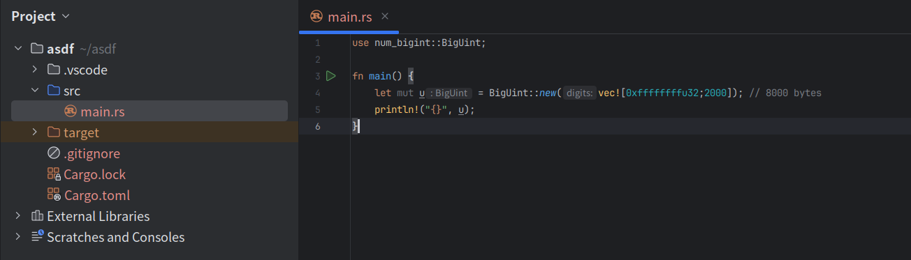

# Synopsis
1. Hybrid assignment of u8 array for BigInteger. For example, if an array that size is 5, it could be `u32` + `u8` (4 + 1 = 5). The similar library `num-bigint` works with `Vec<u32>`, but `numtools` is `Box<[u8]>`. Let's see a video.  

